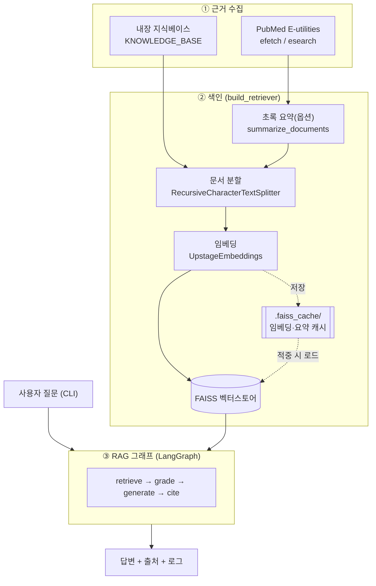
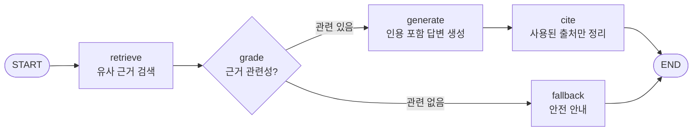

# langchain-mini

LangGraph + Upstage(solar-pro) 기반 **의료 진단 RAG 에이전트(근거 기반 답변 + 출처 표시)** 프로젝트입니다.

## 프로젝트 구조

```
langchain-mini/
├─ pyproject.toml / uv.lock        # uv 프로젝트 정의
├─ main.py                         # 플레이스홀더 진입점
└─ langchain-practice/
   ├─ medical_diagnosis_rag.py     # ★ 의료 진단 RAG 에이전트 (CLI)
   └─ .env / .env.template         # 환경 변수
```

---

# 의료 진단 RAG 에이전트 — 근거 기반 답변 + 출처 표시

증상 질문을 받아 **의료 지식베이스(내장 + PubMed 논문)에서 근거를 검색**하고,
그 근거만으로 답변을 생성한 뒤 **실제로 인용한 출처를 명시**하는 CLI RAG 프로그램입니다.
`LangGraph` + `ChatUpstage(solar-pro)` 로 구현되어 있습니다.

> ⚠️ **의료 면책**: 본 프로그램의 답변은 RAG/출처표시 **학습용 예제**이며 의학적 진단이 아닙니다.
> 실제 증상이 있으면 반드시 의료 전문가의 진료를 받으세요.

---

## 전체 아키텍처

데이터가 어디서 들어와(근거 수집) → 어떻게 색인되고(임베딩/캐시) → 어떻게 답변·출처가 만들어지는지(RAG 그래프) 보여줍니다.



---

## RAG 처리 흐름 (LangGraph)



| 노드 | 역할 |
|---|---|
| `retrieve` | 질문을 임베딩해 FAISS에서 유사 근거 청크 top-k 검색 |
| `grade` | 검색된 근거로 답할 수 있는지 LLM이 판정(structured output). 불가하면 fallback |
| `generate` | 근거에 `[1] [2]` 번호를 붙여, 그 내용만으로 인용 포함 답변 생성 |
| `cite` | 답변 본문에 **실제 등장한 인용 번호만** 골라 출처 목록으로 매핑 |
| `fallback` | 근거 부족 시 환각 대신 안전 안내 메시지 반환 |

---

## 코드 구조 (`langchain-practice/medical_diagnosis_rag.py`)

파일은 위에서 아래로 "설정 → 데이터 → 색인 → 그래프 노드 → 실행" 순서로 구성되어 있습니다.

```
medical_diagnosis_rag.py
├─ setup_logging()                  # 콘솔 + 파일 동시 로깅
├─ [1] 환경 설정                     # ChatUpstage(solar-pro), UpstageEmbeddings 초기화
├─ [2] KNOWLEDGE_BASE               # 내장 의료 문서(출처 메타데이터 포함)
├─ [2-b] PubMed 수집 (E-utilities)
│   ├─ _eutils_get()               # NCBI API 호출(API 키 선택적)
│   ├─ parse_pmid()                # URL/문자열에서 PMID 추출
│   ├─ _article_to_document()      # XML → Document(출처 메타데이터)
│   ├─ fetch_pubmed_by_ids()       # PMID로 초록 수집
│   └─ fetch_pubmed_by_query()     # 검색어로 논문 수집
├─ [2-c] 비용 절감
│   ├─ summarize_documents()       # 초록 요약(+요약 캐시)
│   └─ _docs_fingerprint()         # 캐시 키(청크+모델 해시)
├─ [3] build_retriever()           # 분할 → (캐시) → 임베딩 → FAISS → retriever
├─ [4] DiagnosisState              # 그래프 공유 상태(TypedDict)
├─ [5~9] 그래프 노드               # retrieve / grade / generate / cite / fallback
├─ [10] build_graph()              # StateGraph 구성·컴파일
└─ [11~12] diagnose(), main()      # 실행 헬퍼 + CLI 진입점
```

### 핵심 설계 포인트
- **상태 공유**: 모든 노드는 `DiagnosisState`(TypedDict)를 입출력으로 주고받습니다.
- **출처 추적**: 문서를 청크로 쪼개도 `metadata`(title/source/url/published/pmid)가 유지되어 검색 결과에서 출처를 역추적할 수 있습니다.
- **정확한 인용**: `generate`가 동일 출처(PMID→URL→제목 우선순위)를 하나의 번호로 통합하고, `cite`가 **본문에 실제 등장한 번호만** 출처로 남깁니다.
- **환각 억제**: 근거만 사용하도록 프롬프트로 제약하고, `grade`에서 근거가 부족하면 `fallback`으로 분기합니다.

---

## 주요 특징

- **근거 기반 답변**: 지식베이스에 있는 내용만 사용 → 환각 억제
- **정확한 출처 표시**: 실제 인용 번호만 매핑, 동일 출처는 하나의 번호로 통합
- **PubMed 연동**: NCBI 공식 E-utilities API로 논문 초록 수집(URL/PMID/검색어)
- **비용 절감**: FAISS 임베딩 캐시 + PubMed 초록 요약 캐시
- **로그 기록**: 콘솔 + 로그 파일에 진행 과정·답변·출처 동시 기록

---

## 설치

이 프로젝트는 **uv** 로 관리됩니다. 저장소 루트(`langchain-mini`)에서:

```bash
uv sync
```

직접 설치할 경우 필요한 패키지:

```bash
pip install langchain langchain-core langchain-community langchain-text-splitters \
            langchain-upstage langgraph faiss-cpu python-dotenv
```

---

## 환경 변수 (`.env`)

`langchain-practice/.env` 에 아래 값을 설정합니다 (`.env.template` 참고).

| 키 | 필수 | 설명 |
|---|---|---|
| `UPSTAGE_API_KEY` | ✅ | Upstage LLM·임베딩 호출용 키 |
| `NCBI_EMAIL` | 권장 | PubMed API 사용 시 NCBI 권장 연락 이메일 |
| `NCBI_API_KEY` | 선택 | **없어도 동작.** 있으면 NCBI 요청 한도 3→10회/초 |

---

## 실행

> 아래는 저장소 루트에서 uv 로 실행하는 예시입니다.

```bash
# 1) 데모 질문 세트 실행
uv run python langchain-practice/medical_diagnosis_rag.py

# 2) 직접 질문
uv run python langchain-practice/medical_diagnosis_rag.py "오른쪽 아랫배가 아프고 미열이 있어요"

# 3) 진행 과정 상세 로그(검색된 문서 제목까지)
uv run python langchain-practice/medical_diagnosis_rag.py --debug "한쪽 머리가 욱신거리고 빛이 부셔요"
```

### PubMed 논문을 근거로

```bash
# 특정 논문 URL 또는 PMID 를 근거로 (여러 번 지정 가능)
uv run python langchain-practice/medical_diagnosis_rag.py \
  --pubmed-url "https://pubmed.ncbi.nlm.nih.gov/33429178/" \
  "악성 외이도염의 원인균과 치료는?"

# 검색어로 관련 논문 자동 수집
uv run python langchain-practice/medical_diagnosis_rag.py \
  --pubmed-query "malignant otitis externa treatment" --pubmed-max 3 "악성 외이도염 치료는?"

# 내장 지식베이스를 빼고 PubMed 근거만 + 초록 요약으로 토큰 절감
uv run python langchain-practice/medical_diagnosis_rag.py --no-kb --summarize \
  --pubmed-url 33429178 "악성 외이도염 원인균과 치료는?"
```

### CLI 옵션

| 옵션 | 기본값 | 설명 |
|---|---|---|
| `question` | — | 증상 질문(생략 시 데모 세트 실행) |
| `--log-file` | `medical_diagnosis_rag.log` | 로그 파일 경로 |
| `--k` | `3` | 검색 문서 수(top-k) |
| `--debug` | off | 디버그 로그 출력 |
| `--pubmed-url` | — | PubMed URL 또는 PMID (여러 번 지정 가능) |
| `--pubmed-query` | — | PubMed 검색어로 관련 논문 추가 |
| `--pubmed-max` | `3` | `--pubmed-query` 시 최대 논문 수 |
| `--no-kb` | off | 내장 지식베이스 제외, PubMed 근거만 사용 |
| `--summarize` | off | PubMed 초록을 요약 후 임베딩(컨텍스트 축소) |
| `--no-cache` | off | 임베딩/요약 캐시 미사용(항상 새로 계산) |

---

## 출력 예시

```
### (1) 의심 가능한 상태
악성 외이도염은 주로 당뇨병·고령자·면역저하자에서 발생하며, 녹농균이 가장 흔한 원인균입니다 [1].
...

----------------------------------------
[ 참고 출처 ]
  [1] Malignant otitis externa: An updated review. - PubMed - American journal of otolaryngology / ... (2021)
       https://pubmed.ncbi.nlm.nih.gov/33429178/

[!] 본 답변은 참고용 정보이며 의학적 진단이 아닙니다. 정확한 진단은 의료기관에서 받으세요.
```

---

## 비용과 캐싱

| 구분 | 비용 | 비고 |
|---|---|---|
| PubMed E-utilities | **무료** | API 키 없이 동작(초당 3회), 키 있으면 10회/초 |
| Upstage 임베딩 | 유료(토큰) | 문서 임베딩 + 질문 임베딩 |
| Upstage solar-pro | 유료(토큰) | `grade`, `generate` (질문당 2회), `--summarize` 시 요약 1회 |

**캐시로 비용 절감** (`.faiss_cache/`, git 추적 제외):
- **FAISS 임베딩 캐시**: 동일 문서셋 재실행 시 임베딩 재호출 없이 인덱스 로드. 청크 내용·임베딩 모델이 바뀌면 캐시 키가 달라져 자동 무효화됩니다.
- **PubMed 요약 캐시**: 같은 초록은 두 번 요약하지 않음(`pubmed_summaries.json`).
- PubMed 수집(무료)은 매 실행마다 수행되어 항상 최신 데이터를 받습니다.

---

## 지식베이스 확장

`medical_diagnosis_rag.py` 의 `KNOWLEDGE_BASE` 리스트에 `Document` 를 추가하면 됩니다.
출처 표시를 위해 `metadata` 에 `title / source / url / published` 를 넣으세요.

```python
Document(
    page_content="질환 설명 ...",
    metadata={"title": "문서 제목", "source": "발행 기관",
              "url": "https://...", "published": "2024"},
)
```

실제 진료지침 PDF 를 쓰려면 `PyPDFLoader` 등으로 로드해 같은 형태의 `Document` 로 변환하면 됩니다.
